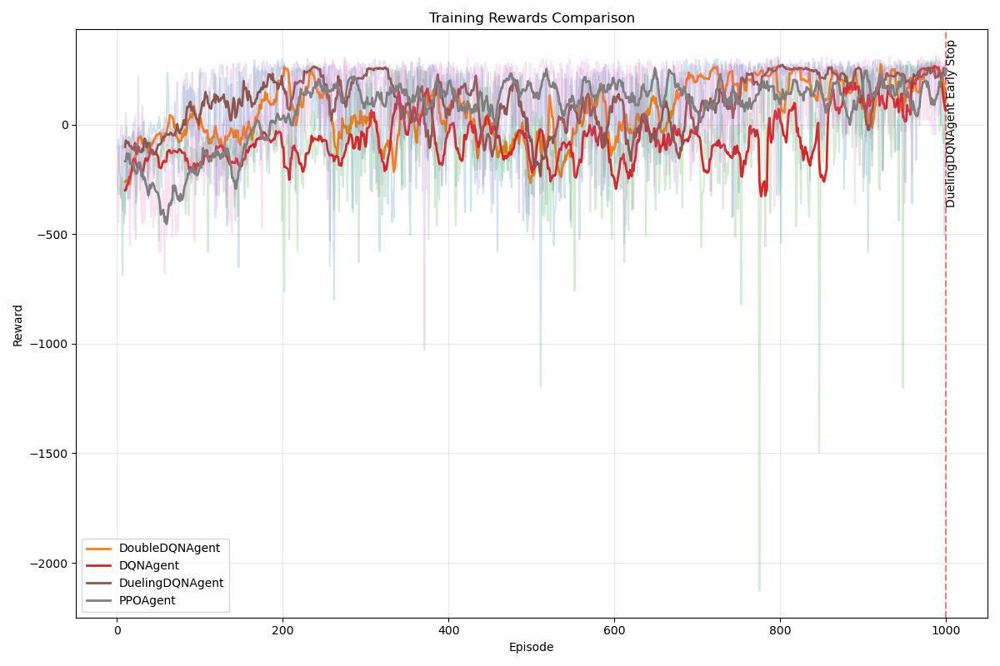
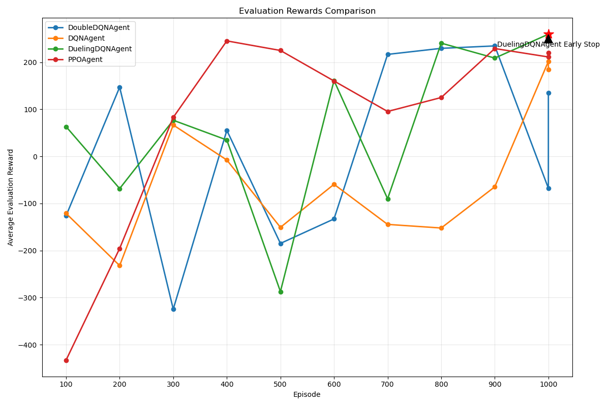
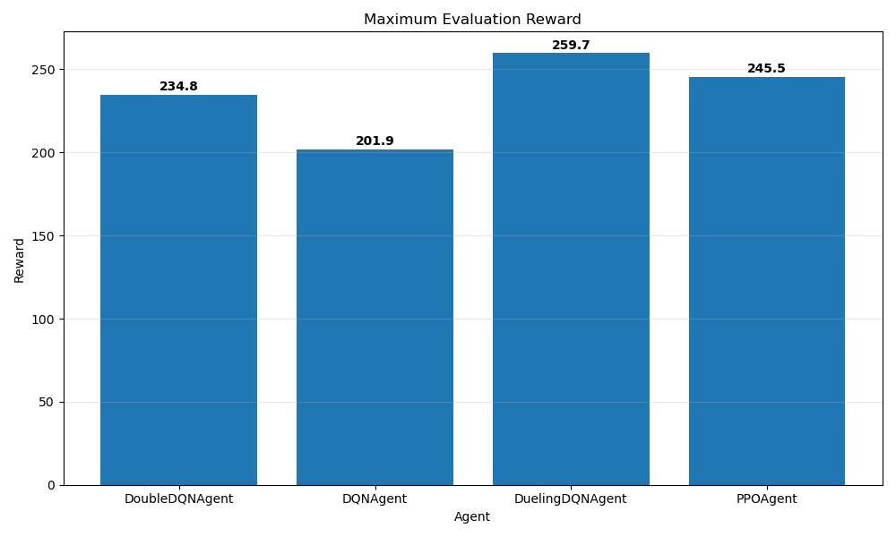
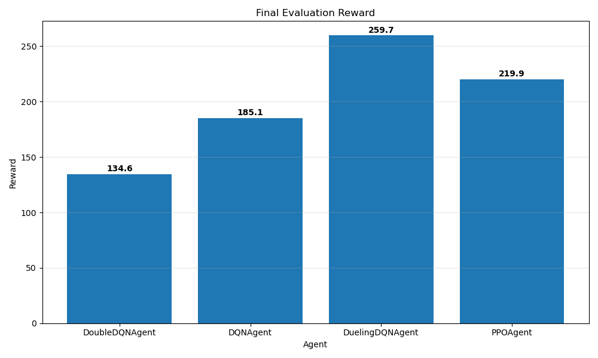
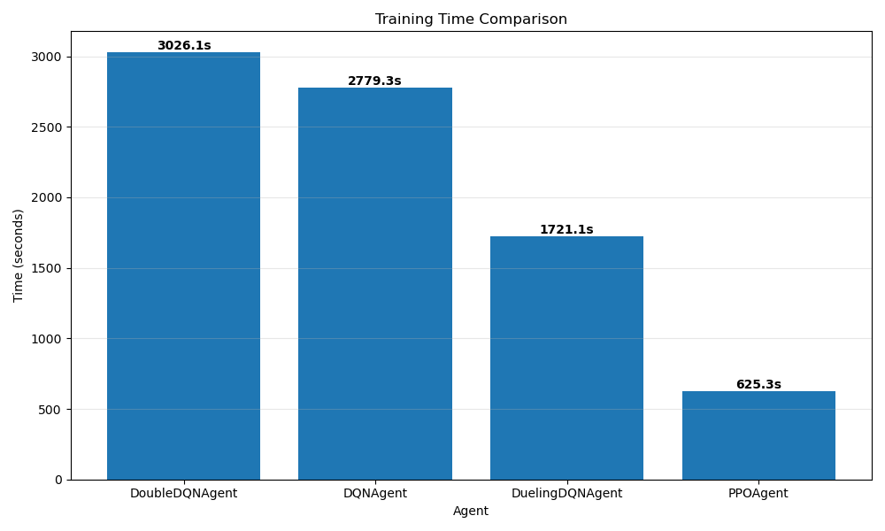

# Lunar Lander - A Reinforcement Learning Comparison

## Overview

This project implements and compares various reinforcement learning algorithms for solving the Lunar Lander environment from OpenAI's Gymnasium. The goal is to train an agent to successfully land a lunar module on the moon's surface, simulating autonomous vehicle control in a challenging physics-based environment.

The project features a modular, object-oriented design that makes it easy to implement, test, and compare different reinforcement learning approaches.

## Environment

The Lunar Lander environment presents a challenging control problem:

**State Space (8 dimensions):**
1. Horizontal position
2. Vertical position
3. Horizontal velocity
4. Vertical velocity
5. Angle of the lander
6. Angular velocity
7. Left leg contact with ground (boolean)
8. Right leg contact with ground (boolean)

**Action Space (4 discrete actions):**
1. Do nothing
2. Fire left engine
3. Fire main engine
4. Fire right engine

**Rewards:**
- +100 for landing successfully
- -100 for crashing
- Smaller rewards/penalties for moving toward/away from the landing pad
- Small penalty for fuel consumption (firing engines)
- Small rewards for leg contact with the ground

The episode ends when the lander either:
- Successfully lands (both legs in contact with the ground, low velocity)
- Crashes (body makes contact with the ground)
- Flies out of bounds
- Reaches maximum time steps (runs out of fuel)

## Implemented Algorithms

This project implements several reinforcement learning algorithms:

1. **Deep Q-Network (DQN)**: A value-based method that uses a neural network to approximate the action-value function (Q-function). DQN uses experience replay and a target network to stabilize training.

2. **Double DQN**: An enhancement to DQN that addresses the overestimation bias by decoupling action selection and evaluation using the online and target networks.

3. **Dueling DQN**: An architecture modification that separates the estimation of state value and action advantages, allowing for more robust learning of state-value functions.

4. **Proximal Policy Optimization (PPO)**: A policy gradient method that uses a clipped surrogate objective to ensure stable training while allowing for larger policy updates than traditional methods.

## Project Structure

The code is organized with a clear, modular structure:

```
├── agents/               # Agent implementations
│   ├── __init__.py       # Exports agent classes
│   ├── base_agent.py     # Abstract base class for all agents
│   ├── utils.py          # Common utilities (replay buffer, exploration strategies)
│   ├── networks.py       # Neural network architectures
│   ├── dqn_agent.py      # DQN implementation
│   ├── double_dqn_agent.py # Double DQN implementation
│   ├── dueling_dqn_agent.py # Dueling DQN implementation
│   └── ppo_agent.py      # PPO implementation
├── models/               # Saved model weights
├── logs/                 # Training logs and metrics
├── plots/                # Generated performance visualizations
├── train.py              # Main training script
├── visualize.py          # Script to visualize and compare results
└── requirements.txt      # Project dependencies
```

## Installation

1. Clone this repository:
```bash
git clone https://github.com/yourusername/lunar_lander.git
cd lunar_lander
```

2. Install dependencies:
```bash
pip install -r requirements.txt
```

## Usage

### Training an Agent

To train an agent, use the `train.py` script:

```bash
# Train a DQN agent (default)
python train.py

# Train a specific agent type
python train.py --agent double_dqn

# Customize training parameters
python train.py --agent ppo --episodes 2000 --eval-interval 100 --render
```

Available agent types: `dqn`, `double_dqn`, `dueling_dqn`, `ppo`

Command-line arguments:
- `--agent`: Type of agent to train
- `--episodes`: Number of episodes to train
- `--max-steps`: Maximum steps per episode
- `--eval-episodes`: Number of episodes for evaluation
- `--eval-interval`: Evaluate every n episodes
- `--render`: Render environment during evaluation
- `--seed`: Random seed for reproducibility
- `--log-dir`: Directory to save logs
- `--model-dir`: Directory to save models
- `--load-model`: Path to load a pre-trained model

### Visualizing Results

After training multiple agents, you can compare their performance using the `visualize.py` script:

```bash
# Compare all agents in the logs directory
python visualize.py

# Compare specific agents
python visualize.py --agents DQNAgent DoubleDQNAgent

# Customize visualization
python visualize.py --smoothing 20 --save-dir custom_plots
```

Command-line arguments:
- `--log-dir`: Directory containing log files
- `--agents`: Specific agents to compare (e.g., `DQNAgent DoubleDQNAgent`)
- `--save-dir`: Directory to save output plots
- `--smoothing`: Window size for moving average smoothing

## Results and Comparison

The visualization script generates several plots and metrics for comparing agent performance:

1. **Training Rewards**: Shows how the episode rewards evolve during training.
2. **Evaluation Rewards**: Compares how agents perform during periodic evaluations.
3. **Maximum Reward**: Compares the maximum evaluation reward achieved by each agent.
4. **Final Reward**: Compares the final evaluation reward after training.
5. **Training Time**: Compares the total training time for each agent.
6. **Metrics Table**: A detailed comparison table with various performance metrics.

### Results


| Agent | Max Reward | Final Reward | Training Time (s) | Episodes to 90% Max | Early Stopped | Episodes Trained | Sample Efficiency |
|-------|------------|--------------|-------------------|---------------------|---------------|------------------|-------------------|
| DoubleDQNAgent | 234.85 | 134.58 | 3026.149714 | 700 | No | 1000 | 0.1346 |
| DQNAgent | 201.89 | 185.08 | 2779.267275 | 1000 | No | 1000 | 0.1851 |
| DuelingDQNAgent | 259.68 | 259.68 | 1721.074177 | 800 | Yes | 1000 | 0.2597 |
| PPOAgent | 245.53 | 219.90 | 625.259019 | 400 | No | 1000 | 0.2199 |

**Training Rewards**



**Evaluation Rewards**



**Maximum Reward**



**Final Reward**



**Training Time**




